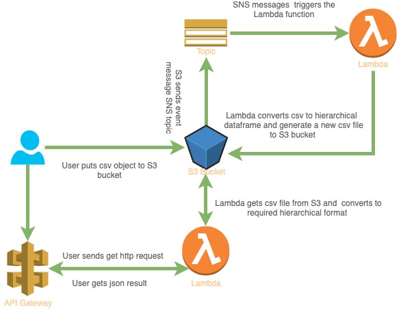

[](https://circleci.com/gh/yai333/HierarchicalDataVisualization)

# Present hierarchical relationship data

This is pipeline demo how to convert csv with multi levels relationship data to hierarchical tabular view, it includes 2 solutions:


- Running in Jupiter notebook (HierarchyDataVisualization.ipynb).
- Serverless solution using AWS S3, Lambda, Api Gateway.

# Overview of the Pipeline

- Upload csv file to an S3 bucket.
- A S3 event trigger will invoke an AWS Lambda function, which will convert multi levels relationship data to -hierarchical tabular data frame and put the object to S3 output bucket.
- A Http Api endpoint can also get hierarchical data in JSON format by file key uploaded to S3.



# Prerequisites

The following must be done before following this guide:

- Setup an AWS account.
- Configure the AWS CLI with user credentials.
- Install AWS CLI.
- Install Serverless Framework.
- Install pip libs from requirment.dev.txt for unit test or requirements.text for deployment.

There are some sample csv files with different scenarios in `test/documents/`.

# CI/CD

The project already setups with CircleCI, you can integrate your repo to CircleCI to Automate the whole CI/CD flow.
check out `.circle/config.yml`.

# Run script in Jupiter notebook

[HierarchyDataVisualization.ipynb](HierarchyDataVisualization.ipynb)

# Setup local environment

## Install Serverless Framework

Before getting started, Install the Serverless Framework. Open up a terminal and type `npm install -g serverless` to install Serverless framework.

then, go to project root level, run `npm install`.

# Deploy

Once you deploy your service, the value of those API keys will be auto generated by AWS and printed on the screen for you to use. The values can be concealed from the output with the --conceal deploy option.

```
sls deploy --stage dev --region YOUR-REGION --aws-profile YOUR-PROFILE
```

# Run Program

Upload demo csv file to S3 bucket which you defined in `serverless.yml`:

```
aws s3 cp test/documents/default.csv s3://YOUR_S3_BUCKET/dev/uploads/test.csv --profile YOUR_PROFILE
```

There will be a converted output .csv file generated in `s3://YOUR_S3_BUCKET/dev/output/.../default.csv`

You can also call REST Api to get a json ouput:

```
curl -X GET -H "x-api-key: DEPLOYED_API_KEY" -H "Content-Type: application/json" https://XXXXXX.execute-api.ap-southeast-2.amazonaws.com/dev/employees?file_key=YOU_UPLOADED_CSV_FILE
```

# Unit test

Install pip libs from requirements.dev.txt and run pytest in test directory.

```
pipenv shell
pipenv install -r requirements.dev.txt
cd test
pytest -s
```
